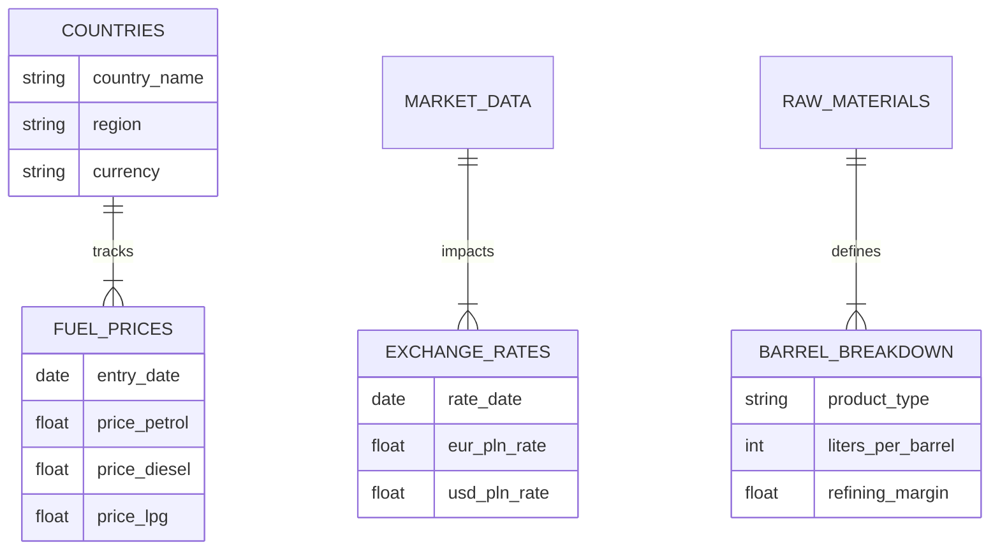

⛽ EU Fuel Prices \& Oil Value Chain Analysis

📌 Project Overview

This project visualizes fuel price trends across European markets and analyzes the economic value chain of crude oil processing. The dashboard connects raw material costs (Crude Oil) with retail prices at the pump, factoring in exchange rate fluctuations.

⚠️ Disclaimer: The data presented in this dashboard (dates set to 2025-2026 and currency rates) are \*\*simulated / mock data\*\* used for stress-testing the visualization layout and logic. They do not reflect current real-world market values.

📊 Dashboards

1. Market Overview  Geospatial Analysis

[Main Dashboard](images/dashboard-fuel-prices-eu.png)

Comparative Analysis: Retail prices of Petrol, Diesel, and LPG across key European nations.

Geospatial Mapping: Interactive map visualizing price density in the EU region.

Currency Impact: Visualization of EUR/PLN exchange rate volatility (simulated scenario).

2. "From Well to Tank" - Production Efficiency

[Barrel Analysis](images/dashboard-oil-barrel-breakdown.png)

Refining Efficiency: Breakdown of a standard crude oil barrel (159 liters) into end-products.

Value Calculation: Derived economic value of Petrol vs. Diesel from raw material input.

 🏗️ Data Model (Reconstructed)

Since this project focuses on the analytical layer, the underlying data structure is designed to support multi-dimensional analysis. Below is the entity-relationship logic used:

